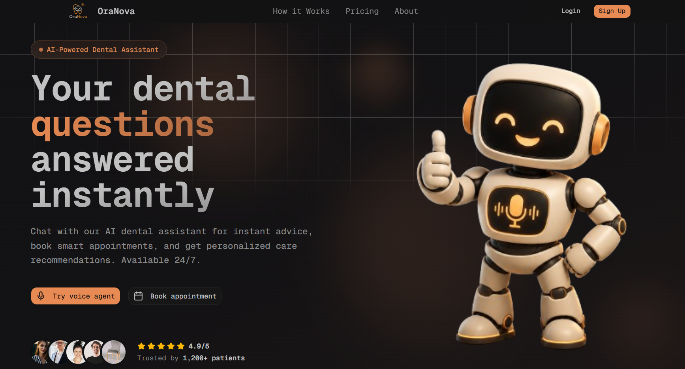
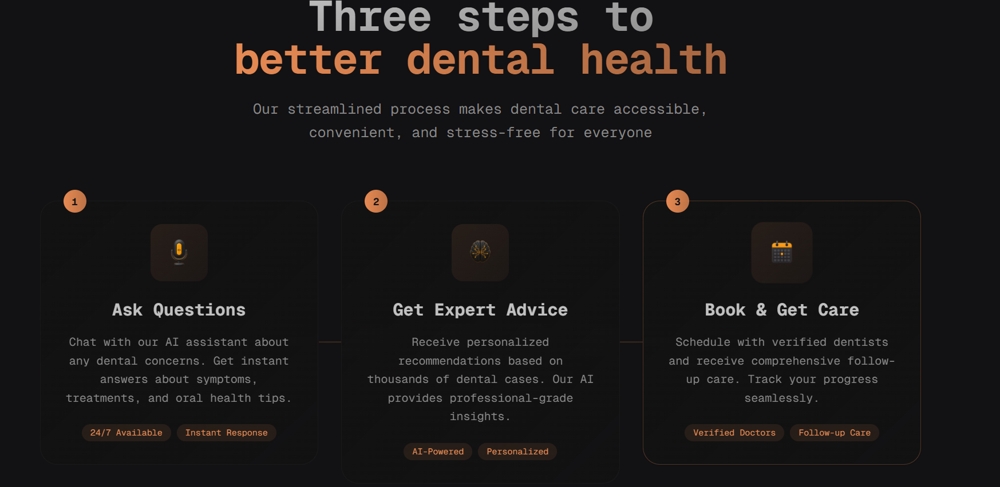
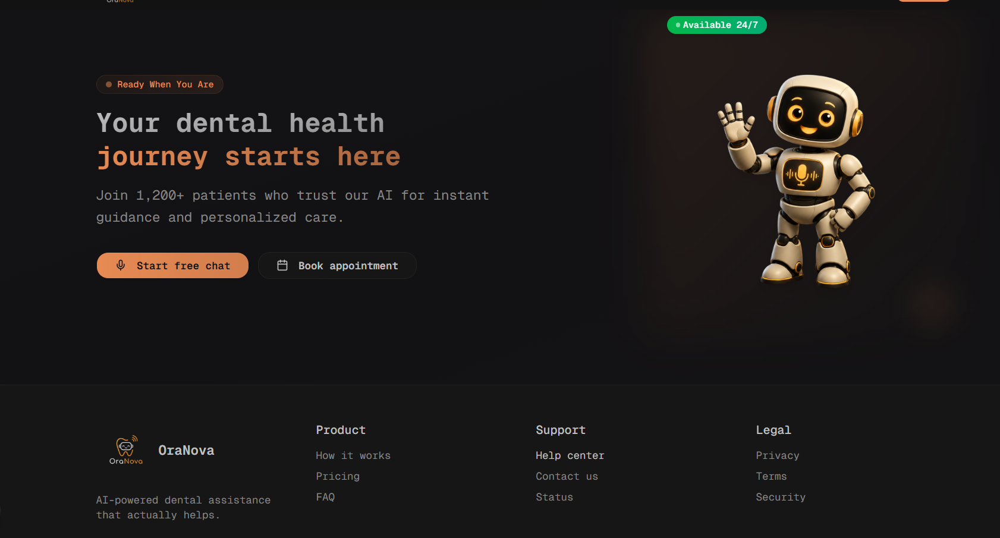
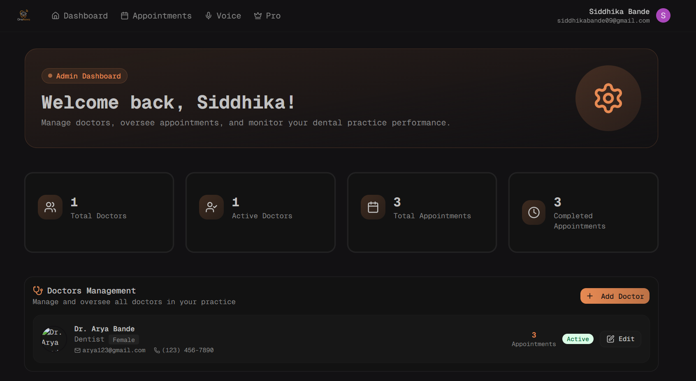
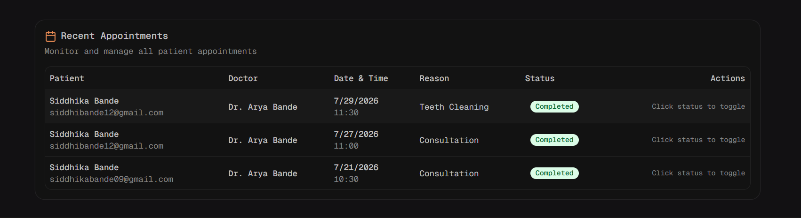
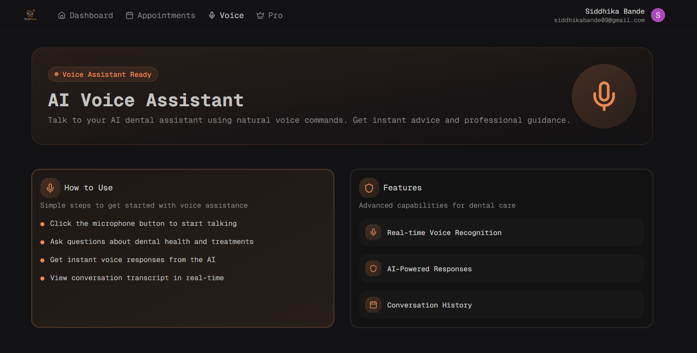
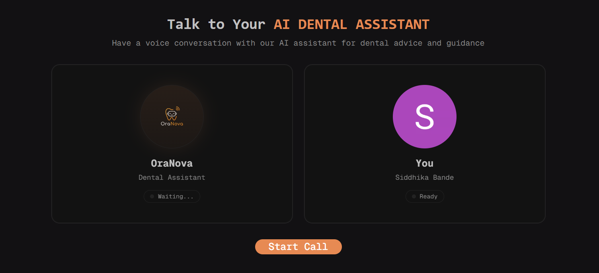

# 🦷 OraNova - AI Powered Dental Assistant

<div align="center">


### AI-powered dental appointment booking and voice consultation platform

</div>

---

## 📖 Overview

OraNova is a modern AI-powered dental platform that helps patients book appointments, interact with an intelligent voice assistant, and manage their dental care seamlessly.

The platform provides:

- 🤖 AI Voice Assistant powered by Vapi
- 📅 Smart Appointment Booking
- 👨‍⚕️ Doctor Management Dashboard
- 🔐 Secure Authentication
- 📧 Automated Appointment Emails
- 💳 Subscription Plans
- 📊 Admin Dashboard
- 📱 Fully Responsive UI

---

# ✨ Features

## 👤 Authentication

- Clerk Authentication
- Email & Password Login
- Google Authentication
- Protected Routes
- User Profiles

---

## 📅 Appointment Booking

- Three-step booking process
- Doctor selection
- Date & time scheduling
- Appointment confirmation
- Appointment status tracking

---

## 🤖 AI Voice Assistant

- Real-time voice conversations
- AI-powered dental guidance
- Voice transcription
- Conversation history
- Live speaking indicators
- Vapi integration

---

## 👨‍⚕️ Doctor Management

- Add doctors
- Edit doctor information
- Active/Inactive status
- Appointment statistics
- Doctor directory

---

## 📧 Email Automation

- Appointment confirmation emails
- Beautiful HTML email templates
- Resend integration

---

## 💳 Subscription System

- Free Plan
- AI Basic
- AI Pro
- Premium Voice Assistant
- Clerk Billing Integration

---

## 📊 Dashboard

- Appointment Analytics
- Doctor Overview
- Admin Controls
- Quick Actions

---

## 🎨 Modern UI

- Responsive Design
- Dark Theme
- Beautiful Gradients
- Smooth Animations
- Tailwind CSS
- shadcn/ui Components

---

# 🛠️ Tech Stack

## Frontend

- Next.js 15
- React 19
- TypeScript
- Tailwind CSS
- shadcn/ui
- Lucide Icons

---

## Backend

- Next.js Server Actions
- Prisma ORM
- PostgreSQL
- Neon Database

---

## Authentication

- Clerk

---

## AI

- Vapi AI

---

## Email Service

- Resend

---

## State Management

- TanStack Query

---

## Deployment

- Vercel

---

# 📂 Folder Structure

```bash
src
│
├── app
│   ├── admin
│   ├── api
│   ├── appointments
│   ├── dashboard
│   ├── pro
│   └── voice
│
├── components
│   ├── admin
│   ├── appointments
│   ├── dashboard
│   ├── emails
│   ├── landing
│   ├── providers
│   ├── ui
│   └── voice
│
├── hooks
├── lib
├── prisma
└── public
```

---

# 🚀 Installation

Clone the repository

```bash
git clone https://github.com/yourusername/OraNova.git
```

Move into project

```bash
cd OraNova
```

Install dependencies

```bash
npm install
```

Run Prisma

```bash
npx prisma generate
npx prisma db push
```

Run development server

```bash
npm run dev
```

---

# 🔑 Environment Variables

Create a `.env` file.

```env
DATABASE_URL=

NEXT_PUBLIC_CLERK_PUBLISHABLE_KEY=
CLERK_SECRET_KEY=

NEXT_PUBLIC_VAPI_API_KEY=
NEXT_PUBLIC_VAPI_ASSISTANT_ID=

RESEND_API_KEY=

NEXT_PUBLIC_APP_URL=
```

---

# 📸 Screenshots

## Landing Page

<p align="center">
  
</p>

<p align="center">
  
</p>

<p align="center">
  
</p>


---

## Dashboard

<p align="center">
  
</p>

---

## 📅 Appointments

<p align="center">
  
</p>

<p align="center">
  
</p>


---

## 🎙️ AI Voice Assistant

<p align="center">
  
</p>

<p align="center">
  
</p>

---

# Future Improvements

- AI Image Diagnosis
- WhatsApp Integration
- Online Payments
- Medical Reports
- Multi-language Support
- Appointment Reminders
- SMS Notifications
- AI Chat History
- Doctor Availability Calendar

---

# Learning Outcomes

During this project I learned:

- Building scalable Next.js applications
- Clerk Authentication & Billing
- Prisma ORM
- PostgreSQL
- TanStack Query
- AI Voice Integration using Vapi
- Email Automation using Resend
- Modern UI Design with Tailwind CSS
- Git Branching & Merge Workflow
- API Route Development

---

# Contributing

Contributions are welcome.

1. Fork the repository

2. Create a feature branch

```bash
git checkout -b feature-name
```

3. Commit changes

```bash
git commit -m "Added new feature"
```

4. Push changes

```bash
git push origin feature-name
```

5. Open a Pull Request

---

# License

This project is licensed under the MIT License.

---

# Acknowledgements

Special thanks to:

- Next.js
- Clerk
- Prisma
- Vapi AI
- Resend
- Tailwind CSS
- shadcn/ui

---

<div align="center">

### ⭐ If you found this project helpful, consider giving it a star!

Made with ❤️ using Next.js, TypeScript & AI

</div>
